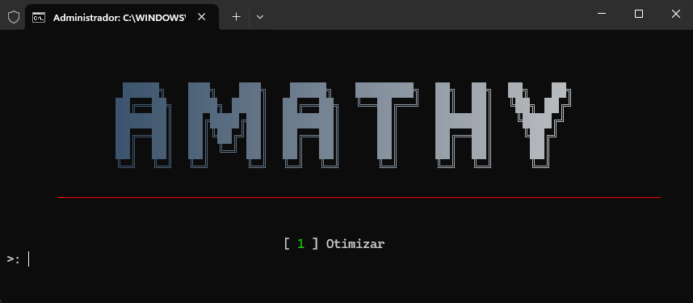

# aMathyBoost

.png)  
**A solução definitiva para otimizar o desempenho do seu sistema!**

[](https://github.com/aMathyzin/aMathyBoost) [](https://github.com/aMathyzin/aMathyBoost) [](LICENSE)

---

## 🚀 Funcionalidades

- 🔧 **Desativa processos desnecessários:** reduz o consumo de recursos do sistema.
- 🎮 **Otimização de jogos:** melhora a performance para jogos.
- ⚡ **Ajustes de energia:** configurações avançadas para economizar ou maximizar desempenho.
- 🔒 **Privacidade aprimorada:** desativa serviços de telemetria e coleta de dados.
- 🎨 **Interface customizável:** escolha cores e estilos para exibir as informações de forma atrativa.

---

## 📋 Requisitos

- Sistema Operacional: **Windows 10/11** (versões atualizadas).
- Privilégios de Administrador.

---

## 📂 Estrutura do Projeto

```plaintext
📦 aMathyBoost
 ┣ 📜 aMathyBoost.bat   # Script principal
 ┣ 📜 README.md         # Documentação
 ┗ 📂 assets            # Imagens e ícones
```

---

## 📥 Como Usar

1. Faça o download do arquivo `aMathyBoost.bat`.
2. Clique com o botão direito e selecione **Executar como Administrador**.
3. Siga as instruções exibidas no console.

> **Nota:** Certifique-se de ter backups importantes antes de aplicar qualquer modificação no sistema.

---

## 🔗 Links Úteis

- 📹 [Canal no YouTube](https://youtube.com/@aMathyzin)
- 💬 [Servidor no Discord](https://amathyzin.com/discord)
- 🌐 [Página Oficial de Download](https://amathyzin.com/downloads/amathyboost)

---

## 🖼️ Pré-visualização

  
**Tela inicial do aMathyBoost mostrando opções de otimização.**

---

## 🧑‍💻 Criação e Autoria

- Desenvolvido por: **Memphis**
- Mantido por: **Grupo aMathyzin**

---

## 📜 Licença

Este projeto é distribuído sob a licença proprietária. Consulte o arquivo [LICENÇA](LICENSE) para mais informações.

---

## ❤️ Agradecimentos

- **aMathyzin** pela criação e suporte contínuo.
- Comunidade do Discord por feedback e sugestões.

> Feito com ❤️ pela equipe aMathyzin!

